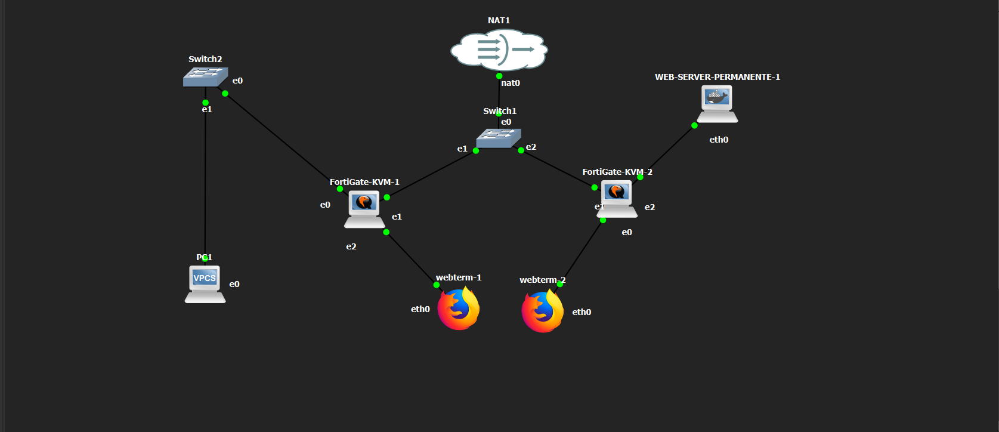
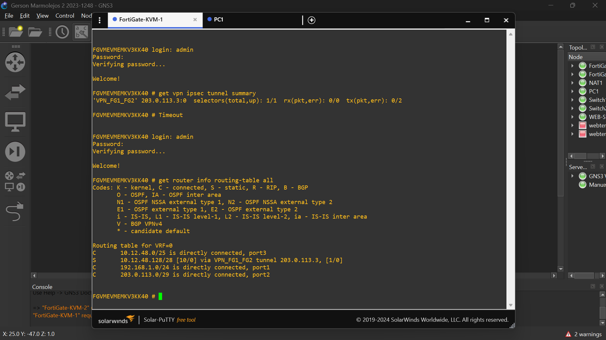
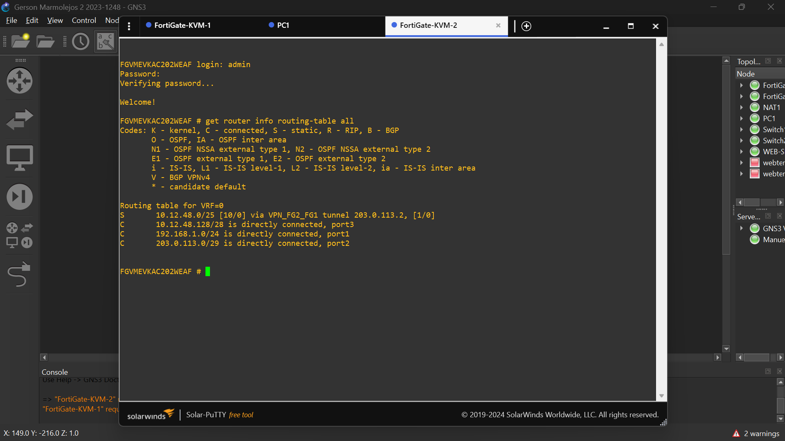
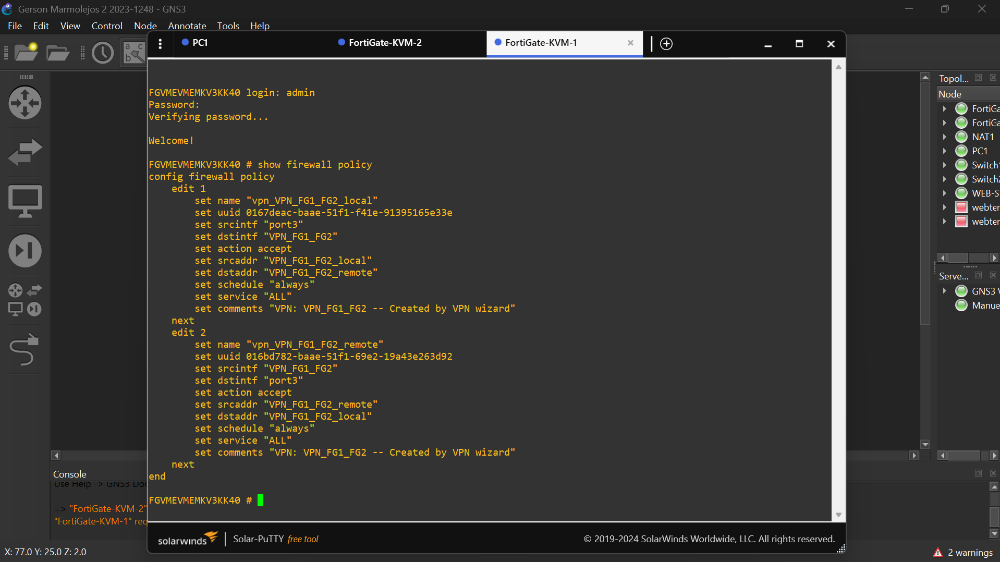
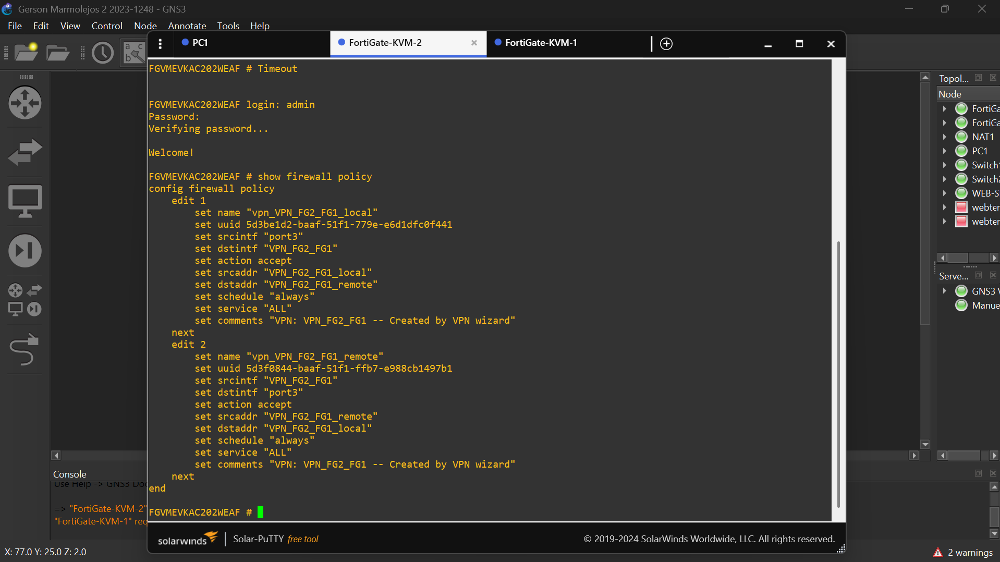
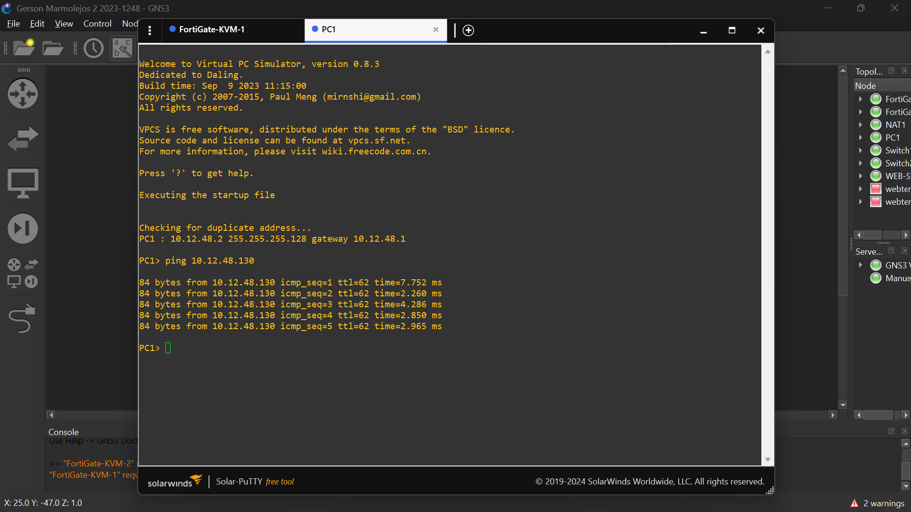
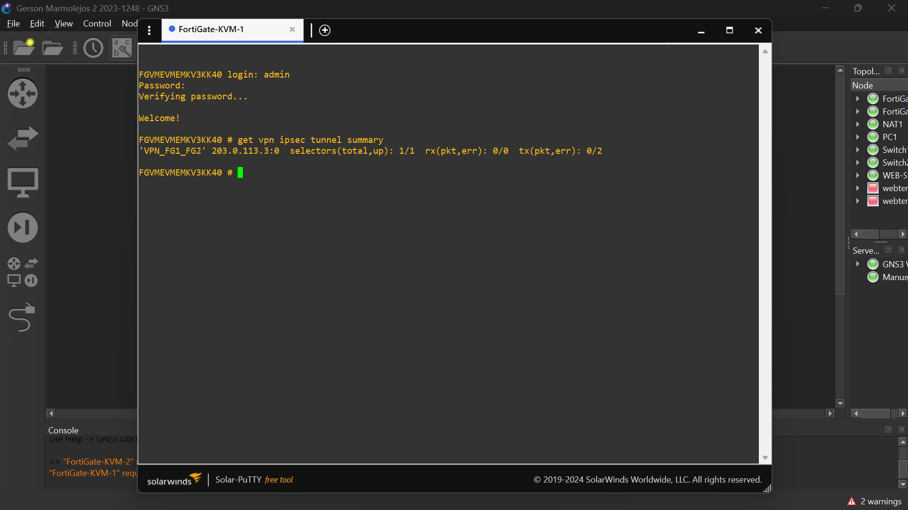
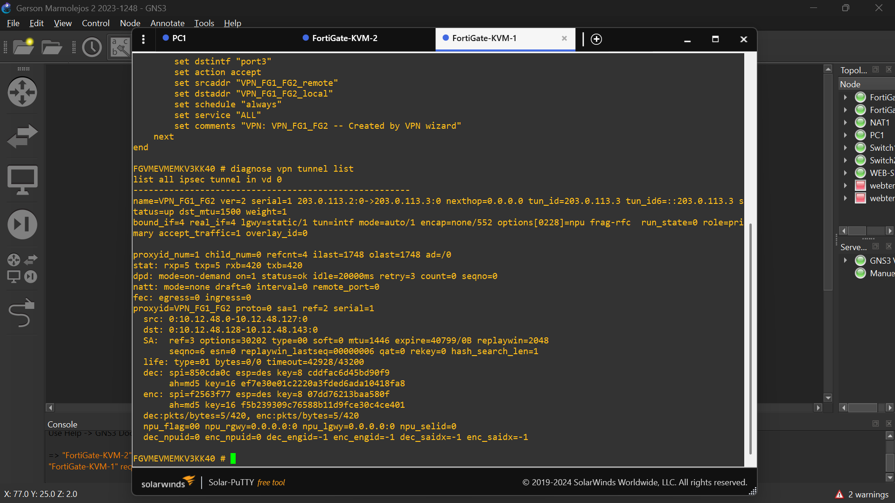

# Infraestructura 1 - VPN Site-to-Site con FortiGate

Laboratorio de VPN IPsec Site-to-Site entre dos FortiGate en GNS3, con documentación, evidencias y running-configs.

## 🎥 Video demostrativo

[Ver video demostrativo](ENLACE_DEL_VIDEO)

---

## 📌 Propósito del laboratorio

El objetivo de esta práctica fue configurar una VPN IPsec Site-to-Site entre dos equipos FortiGate dentro de GNS3.

La idea principal fue lograr que dos redes diferentes pudieran comunicarse de forma segura utilizando un túnel VPN entre ambos FortiGate.

En este caso, una red representa el lado de los usuarios y la otra el lado donde se encuentra el servidor web.

---

## 🖥️ Topología

La infraestructura está formada por los siguientes equipos:

- 2 FortiGate
- 1 PC de usuario
- 1 servidor web
- Switches para representar la conexión entre ambos sitios
- Un nodo NAT para proporcionar conectividad externa
- 2 Webterm utilizados para acceder a la interfaz gráfica de los FortiGate

### Diagrama de la topología



---

## 🌐 Direccionamiento IP

Para separar correctamente ambas redes se utilizó el siguiente direccionamiento:

| Dispositivo | Red / Interfaz | Dirección IP |
|---|---|---|
| FortiGate 1 | WAN | 203.0.113.2/29 |
| FortiGate 2 | WAN | 203.0.113.3/29 |
| FortiGate 1 | LAN de usuarios | 10.12.48.1/25 |
| PC1 | LAN de usuarios | 10.12.48.2/25 |
| FortiGate 2 | LAN de servidores | 10.12.48.129/28 |
| WEB-SERVER | LAN de servidores | 10.12.48.130/28 |

---

## 🔐 Configuración de la VPN Site-to-Site

Se configuró una VPN IPsec Site-to-Site entre los dos FortiGate utilizando IKEv2.

La función de esta VPN es permitir la comunicación entre estas dos redes:

- Red de usuarios: `10.12.48.0/25`
- Red de servidores: `10.12.48.128/28`

Una vez levantado el túnel, el tráfico entre ambas redes puede viajar de forma cifrada a través de la VPN.

---

## 🔄 Enrutamiento

También fue necesario configurar las rutas para que cada FortiGate supiera cómo llegar a la red que se encuentra del otro lado del túnel.

En FortiGate 1 se configuró una ruta hacia:

`10.12.48.128/28`

En FortiGate 2 se configuró una ruta hacia:

`10.12.48.0/25`

De esta manera, cada equipo puede enviar el tráfico correspondiente a través de la VPN.

### Ruta en FortiGate 1



### Ruta en FortiGate 2



---

## 🛡️ Políticas de Firewall

Se crearon las políticas necesarias para permitir el tráfico entre las redes locales y la VPN.

Las principales reglas permiten la comunicación:

- Desde la red local hacia la VPN
- Desde la VPN hacia la red local

Sin estas políticas, aunque el túnel estuviera activo, el tráfico no podría pasar correctamente entre ambas redes.

### Políticas en FortiGate 1



### Políticas en FortiGate 2



---

## ✅ Pruebas realizadas

Para comprobar que la configuración estaba funcionando correctamente se realizaron varias pruebas.

La prueba principal fue hacer ping desde PC1 hacia el servidor web que se encuentra detrás del segundo FortiGate.

**Origen:** `10.12.48.2`

**Destino:** `10.12.48.130`

**Resultado:** comunicación exitosa.

Con esta prueba se confirmó que el tráfico estaba pasando correctamente desde la red de usuarios hacia la red de servidores a través de la VPN.

### Evidencia del ping



---

## 🔎 Verificación del túnel

También se comprobó directamente desde FortiGate que el túnel estuviera activo.

Uno de los comandos utilizados fue:

```bash
get vpn ipsec tunnel summary
```

El resultado mostró el selector activo:

```text
selectors(total,up): 1/1
```

### Estado de la VPN



También se utilizó:

```bash
diagnose vpn tunnel list
```

Con este comando se pudieron revisar los paquetes enviados y recibidos a través del túnel IPsec.

### Tráfico cifrado por IPsec



Esta evidencia muestra que el túnel se encuentra activo y que existen paquetes cifrados y descifrados entre ambos sitios.

---

## 📸 Evidencias

Las capturas utilizadas durante las pruebas se encuentran almacenadas en la carpeta `imagenes/`.

Entre las evidencias incluidas se encuentran:

- Topología completa
- Estado del túnel VPN
- Ping exitoso entre PC1 y WEB-SERVER
- Rutas de ambos FortiGate
- Políticas de firewall
- Tráfico cifrado a través de IPsec

---

## ⚙️ Running Configurations

También se realizaron backups de la configuración de ambos FortiGate.

Los archivos incluidos en el repositorio son:

- `fortigate-1.conf`
- `fortigate-2.conf`

Estos archivos contienen la configuración de cada FortiGate y permiten revisar con mayor detalle los parámetros utilizados durante la práctica.

Las contraseñas y datos sensibles fueron enmascarados antes

## 📸 Evidencias

A continuación se muestran las principales evidencias obtenidas durante la implementación y las pruebas de la infraestructura.

### Topología utilizada


### Estado de la VPN Site-to-Site


### Prueba de conectividad entre PC1 y WEB-SERVER


### Rutas configuradas en FortiGate 1


### Rutas configuradas en FortiGate 2


### Políticas de firewall en FortiGate 1


### Políticas de firewall en FortiGate 2


### Tráfico cifrado por el túnel IPsec


